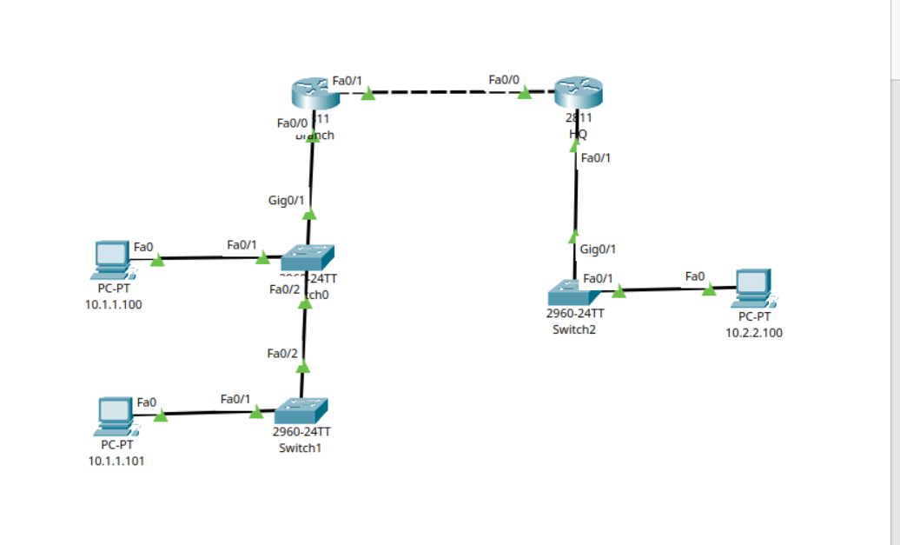

# Enterprise Branch-to-HQ Routing & Switching Lab

A hands-on Cisco Packet Tracer network architecture project demonstrating inter-network connectivity between a corporate Head Office (HQ) and a remote Branch office using static routing, VLAN management, and core Cisco IOS configurations.

## 📌 Project Overview

This repository demonstrates the configuration and deployment of a multi-segment network topology. The primary objective was to establish flawless end-to-end communication across structurally isolated local area networks (LANs) via a simulated Wide Area Network (WAN) link. 

### Key Objectives Achieved:
* Implemented structured IPv4 addressing schemas across multiple distinct subnets.
* Configured core interface mappings on Cisco 2811 series ISR routers.
* Deployed resource-efficient **Default Static Routes** (`0.0.0.0/0`) for optimized routing table management.
* Configured Layer 2 switches with management IP addresses within the respective subnets.
* Verified path selection and latency metrics using ICMP utility diagnostics (`ping` & `tracert`).

---

## 🗺️ Network Topology & Addressing Table



The network is split into three main segments: the Branch LAN (`10.1.1.0/24`), the WAN Point-to-Point Link (`209.165.201.0/27`), and the HQ LAN (`10.2.2.0/24`).

| Device | Interface | IP Address | Subnet Mask | Description / Gateway |
| :--- | :--- | :--- | :--- | :--- |
| **Branch** | FastEthernet0/0 | 10.1.1.1 | 255.255.255.0 | Gateway for Branch LAN |
| | FastEthernet0/1 | 209.165.201.1 | 255.255.255.224 | WAN Link (Local End) |
| **HQ** | FastEthernet0/0 | 209.165.201.2 | 255.255.255.224 | WAN Link (Remote End) |
| | FastEthernet0/1 | 10.2.2.1 | 255.255.255.0 | Gateway for HQ LAN |
| **Switch0** | VLAN 1 (SVI) | 10.1.1.11 | 255.255.255.0 | Management IP (Branch) |
| **Switch2** | VLAN 1 (SVI) | 10.2.2.11 | 255.255.255.0 | Management IP (HQ) |
| **PC-PT (Branch)**| FastEthernet0 | 10.1.1.100 | 255.255.255.0 | Gateway: 10.1.1.1 |
| **PC-PT (HQ)** | FastEthernet0 | 10.2.2.100 | 255.255.255.0 | Gateway: 10.2.2.1 |

---

## ⚙️ Core Device Configurations

### 1. Branch Router Configuration
The Branch router handles local segment traffic and routes all external bounds via its WAN link interface.

```text
hostname Branch
!
interface FastEthernet0/0
 description Link to LAN Switch (SW1)
 ip address 10.1.1.1 255.255.255.0
 duplex auto
 speed auto
!
interface FastEthernet0/1
 description Link to HQ Router
 ip address 209.165.201.1 255.255.255.224
 duplex auto
 speed auto
!
ip route 0.0.0.0 0.0.0.0 209.165.201.2
