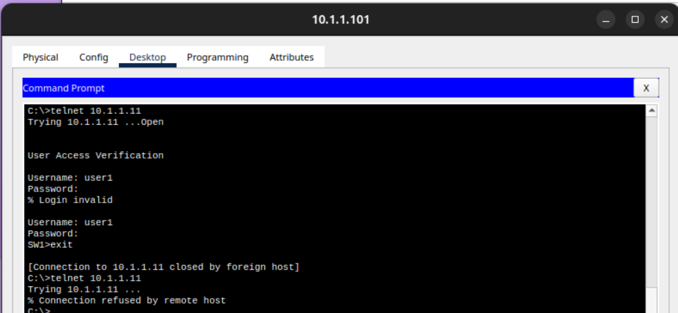
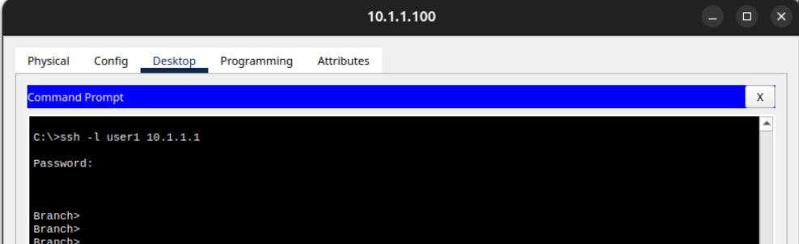

# Lab 04: Advanced Management Plane Hardening (SSH & VTY Access Control Lists)

This project demonstrates how to fully secure remote management traffic across network devices using **Cisco Packet Tracer**. Building upon basic security foundations, this lab implements encrypted **SSHv2** instead of cleartext Telnet on routers, and restricts switch management access to a single authorized administrator host using standard **Access Control Lists (ACLs)** applied to VTY lines.

## 📋 Table of Contents
1. [Project Scenario](#-project-scenario)
2. [Network Devices & Hardening Schema](#-network-devices--hardening-schema)
3. [Configuration Implementation](#-configuration-implementation)
4. [Verification & Visual Assets](#-verification--visual-assets)
5. [Key Security Takeaways](#-key-security-takeaways)

---

## 📋 Project Scenario
Unencrypted remote protocols and unrestricted administrative entry points present significant risks to structural network integrity. This project addresses these management plane vulnerabilities by:
* Transitioning management traffic from Telnet to encrypted **SSH version 2**.
* Generating 1024-bit RSA cryptokeys to handle cryptographic exchanges.
* Creating standard Access Control Lists to enforce IP-based administrative filtering.
* Binding ACL blocks directly to virtual terminal lines (`access-class`) on infrastructure switches.

---

## 🔐 Network Devices & Hardening Schema
* **Authorized Admin Management Host:** `10.1.1.100`
* **Unauthorized Target/Attacker Host:** `10.1.1.101`
* **Branch Gateway Router (`Branch`):** Hardened with SSHv2 (1024-bit keys).
* **HQ Corporate Router (`HQ`):** Hardened with SSHv2 and local credential databases.
* **Switch 1 & Switch 2 (`SW1` / `SW2`):** Protected via VTY `access-class` restrictions.

---

## 🛠️ Configuration Implementation

### Router Hardening (Branch & HQ Gateways)
Both routers enforce SSHv2 encryption parameters, overriding default line rules and binding secure domain associations:

```cisco
! Branch Router Hardening
Branch# configure terminal
Branch(config)# ip domain-name cisco.com
Branch(config)# crypto key generate rsa
! Choose 1024 bits for the cryptographic modulus size
How many bits in the modulus [512]: 1024
Branch(config)# line vty 0 15
Branch(config-line)# transport input ssh
Branch(config-line)# exit
Branch(config)# ip ssh version 2

! HQ Router Hardening
HQ# configure terminal
HQ(config)# username user1 secret cisco
HQ(config)# enable secret cisco
HQ(config)# line console 0
HQ(config-line)# login local
HQ(config-line)# line vty 0 15
HQ(config-line)# login local
HQ(config)# ip domain name cisco.com
HQ(config)# crypto key generate rsa
HQ(config)# line vty 0 15
HQ(config)# ip ssh version 2
HQ(config)# do copy run start
```
---

## 🔍 Verification & Visual Assets



---

## 🔑 Key Security Takeaways
* **`transport input ssh`:** Explicitly drops unencrypted TCP/23 Telnet requests, protecting administrative passwords and device syntax from sniffers and man-in-the-middle exploits.
* **Cryptographic Bit Selection:** Opting for a 1024-bit RSA key modulus ensures the key string satisfies minimum required standard lengths to activate modern **SSHv2** parameters.
* **`access-class` Application:** Traditional firewall filters are usually applied to router interface boundaries; however, utilizing `access-class` locks down the VTY lines locally, ensuring that even internal local threats can't cross unauthorized network segments.
* **Implicit Deny Reminder:** While `access-list 1 deny any` was explicitly written out for transparency, standard IP access lists inherently drop any traffic that doesn't match an explicit permit rule.
