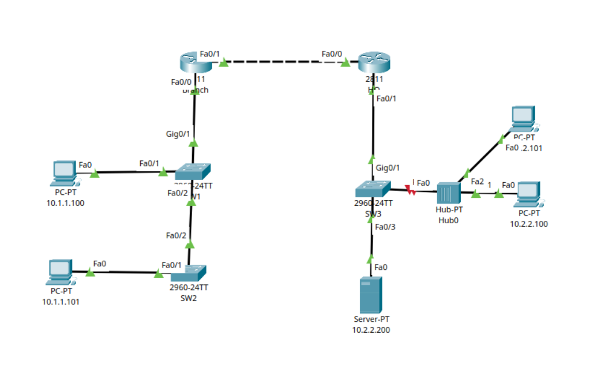

# Network Port Security and Infrastructure Hardening

## Project Overview
This project demonstrates the implementation of **Layer 2 Port Security** and basic infrastructure hardening on an enterprise branch network topology. The core focus is preventing unauthorized devices from connecting to the network by enforcing strict MAC address limits on switch access ports and administratively shutting down unused interfaces to reduce the attack surface.

## Topology Diagram
The network topology includes a headquarters network (HQ), a branch office (Branch), several Cisco 2960 switches, an NTP Server, and multiple end devices.

Refer to the network diagram file `network-topology.png` included in this repository for the visual layout.

### Security Scenario (The "Red Line" Incident)
As visualized by the red link state next to `Hub0` in `network-topology.png`, a security violation is actively demonstrated. A hub is connected to `SW3`'s `Fa0/2` port. When multiple hosts try to communicate through that single port (specifically when host `10.2.2.101` attempts to connect alongside `10.2.2.100`), the switch detects a port security violation (maximum MAC limit exceeded) and immediately places the interface into an **err-disabled (shutdown)** state.

---
## Network Topology

---

## Configuration Breakdown

### Reducing Attack Surface (Disabling Unused Ports)
To prevent unauthorized physical access, all unused FastEthernet and GigabitEthernet interfaces across the switches were administratively shut down.

**Switch 1 (SW1):**
```cisco
SW1(config)# interface range fastEthernet 0/4 - 24
SW1(config-if-range)# shutdown
SW1(config)# interface f0/1
SW1(config-if)# switchport mode access
SW1(config-if)# switchport port-security maximum 1
SW1(config-if)# switchport port-security violation shutdown 
SW1(config-if)# switchport port-security
```
**Switch 2 (SW2):**
```SW2(config)# interface range fastEthernet 0/3 - 24
SW2(config-if-range)# shutdown
SW2(config)# interface range GigabitEthernet 0/1 - 2
SW2(config-if-range)# shutdown
```
**Switch 3 (SW3):**
```SW2(config)# interface f0/1
SW2(config-if)# switchport mode access 
SW2(config-if)# switchport port-security 
SW2(config-if)# switchport port-security maximum 1
SW2(config-if)# switchport port-security violation shutdown
```
---
## Key Takeaways & Verification
Layer 2 Protection: By enforcing switchport port-security violation shutdown, rogue devices or unauthorized network extensions (like adding unmanaged hubs/switches) are immediately neutralized.

Mitigation: To recover a port forced into a shutdown state by a violation, the administrator must remove the offending device, navigate to the interface configuration, and execute the shutdown followed by the no shutdown command (or configure errdisable recovery).
