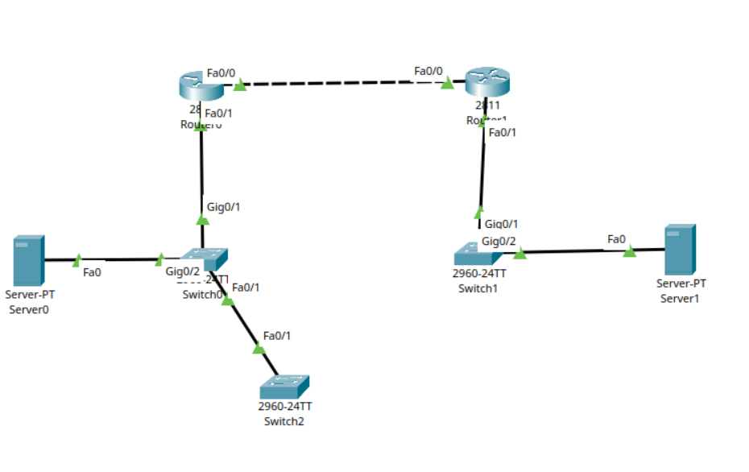
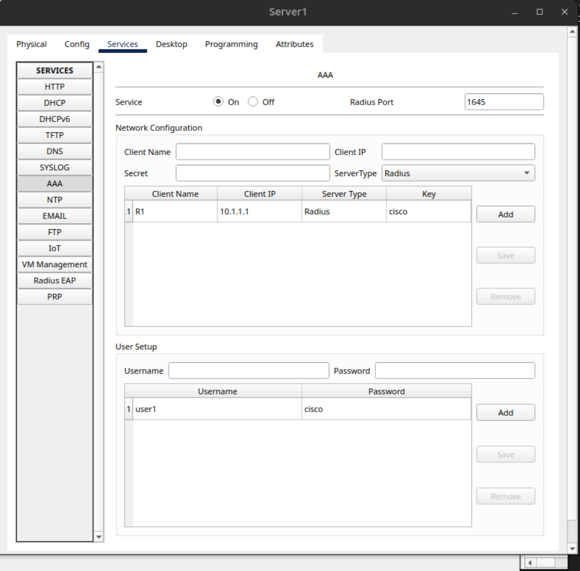
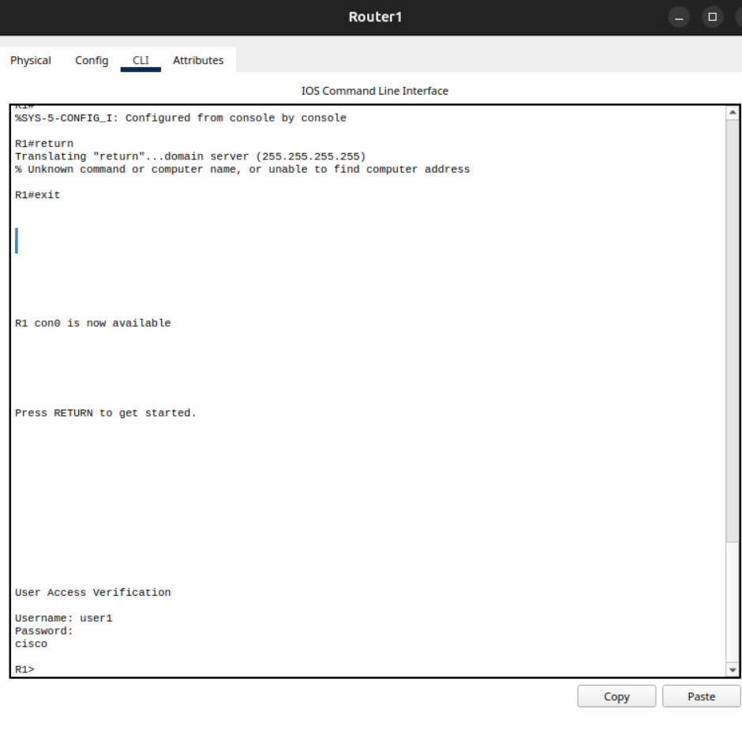
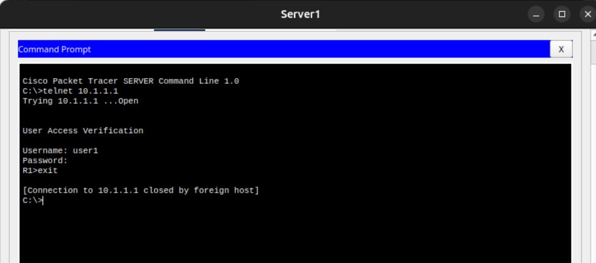

# Cisco AAA Configuration with RADIUS Authentication

This project demonstrates the implementation of centralized **Authentication, Authorization, and Accounting (AAA)** on a Cisco router (`R1`) using a external **RADIUS server** inside Cisco Packet Tracer. 

Centralized authentication ensures that network administrators can manage user credentials from a single server rather than maintaining local user databases on every individual network device.

## Network-Topology

---

## 🛠️ Configuration Details

### 1. Router Configuration (R1)
The following commands were executed on **R1** to enable the new AAA model, define the remote RADIUS server host, configure authentication fallbacks, and apply the policy to the virtual terminal lines (VTY) for secure Telnet access.

```microprofile
R1(config)# aaa new-model 
R1(config)# radius-server host 10.1.1.3 auth-port 1645 key cisco
R1(config)# aaa authentication login default group radius local 
R1(config)# username user1 password cisco

R1(config)# aaa authentication login TELNET group radius local
R1(config)# line vty 0 4
R1(config-line)# login authentication TELNET
```
---

## 🖥️ RADIUS Server Configuration
The external AAA server is configured with the matching parameters to authenticate incoming requests from the client router.


---

## ✅ Verification & Testing
Console Authentication
When accessing the router console line (con0), the device prompts for AAA verification, validating the local/remote credentials before allowing access to the command line interface.


---
## Telnet Access Test
Testing remote connectivity from the Server's command prompt via Telnet to the router's interface (10.1.1.1) successfully triggers the RADIUS authentication mechanism. Inputting the configured credentials (user1 / cisco) successfully opens the remote terminal session.


