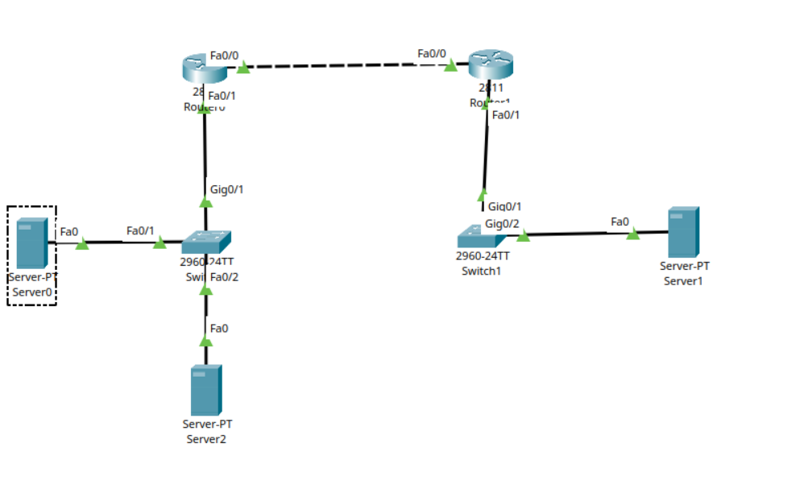
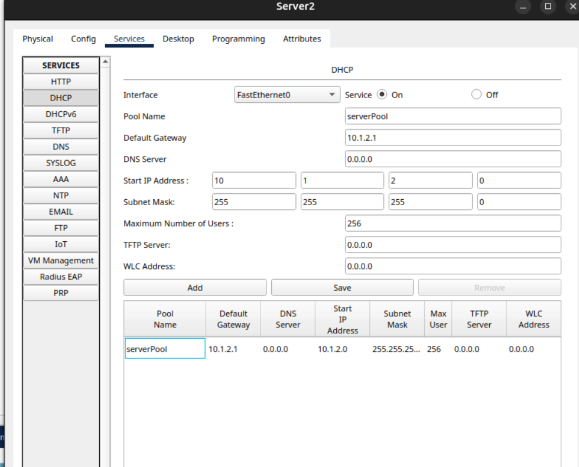
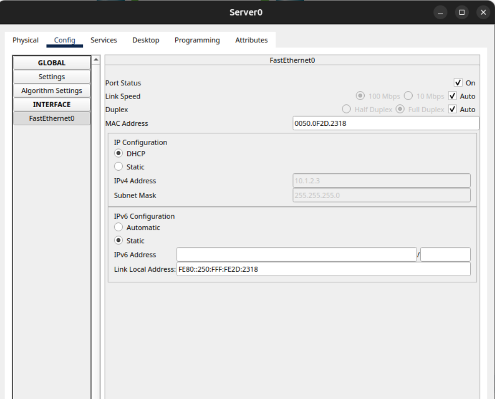

# Project 07: DHCP Server Configuration & DHCP Snooping Security

This project demonstrates the configuration of a centralized DHCP server pool alongside essential Layer 2 security measures. By implementing **DHCP Snooping**, the network is fortified against rogue DHCP servers, ensuring that clients only receive legitimate IP assignments from a trusted source.

## 🌐 Network Topology

The infrastructure consists of interconnected routers, switches, and endpoint servers configured within Cisco Packet Tracer. 

See the complete setup here:


---

## 🛠️ Configuration Steps

### 1. DHCP Server Setup
**Server2** is designated as the primary DHCP server managing the IP address allocations for the local subnet. 

* **Pool Name:** `serverPool`
* **Default Gateway:** `10.1.2.1`
* **IP Range:** Starting from `10.1.2.0` with a `/24` subnet mask (allowing up to 256 users).

The exact server panel configuration can be viewed here:


### 2. Layer 2 Security: DHCP Snooping on SW0
To prevent rogue DHCP attacks and ensure network integrity, **DHCP Snooping** was enabled on `SW0`. This configures the switch to drop DHCP offers from unauthorized ports while keeping track of legitimate IP-to-MAC bindings.

```cisco
SW0(config)# ip dhcp snooping information option
SW0(config)# ip dhcp snooping verify mac-address 
SW0(config)# ip dhcp snooping vlan 1 

# Define the trusted port where the legitimate DHCP server resides
SW0(config)# int f0/2
SW0(config-if)# ip dhcp snooping trust
```
---

## ✅ Verification & Proof
With DHCP Snooping strictly enforced, client devices can seamlessly and securely lease IP addresses.

As shown below, Server0 successfully obtained its configuration (10.1.2.3) via DHCP through the secured switch infrastructure:

