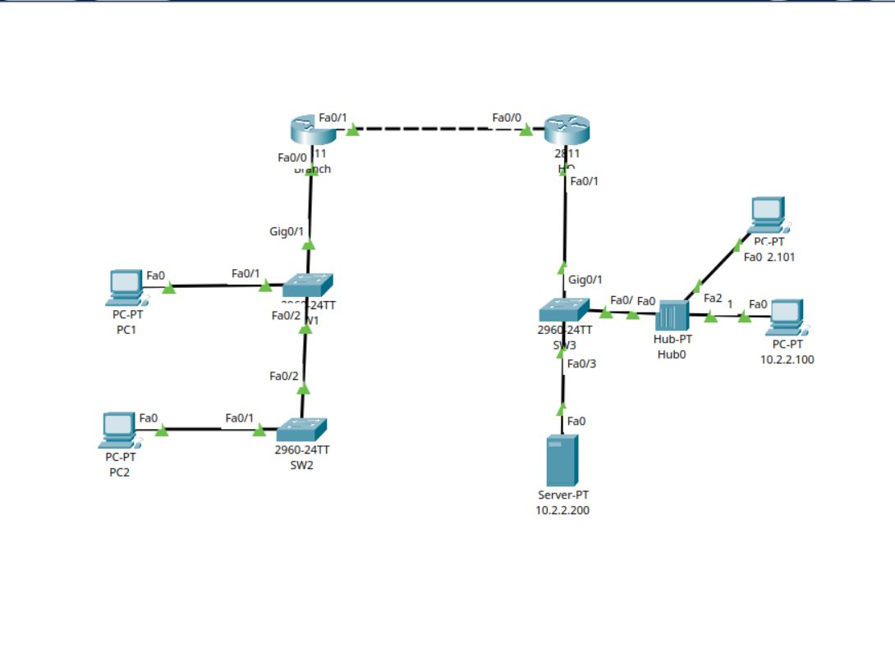
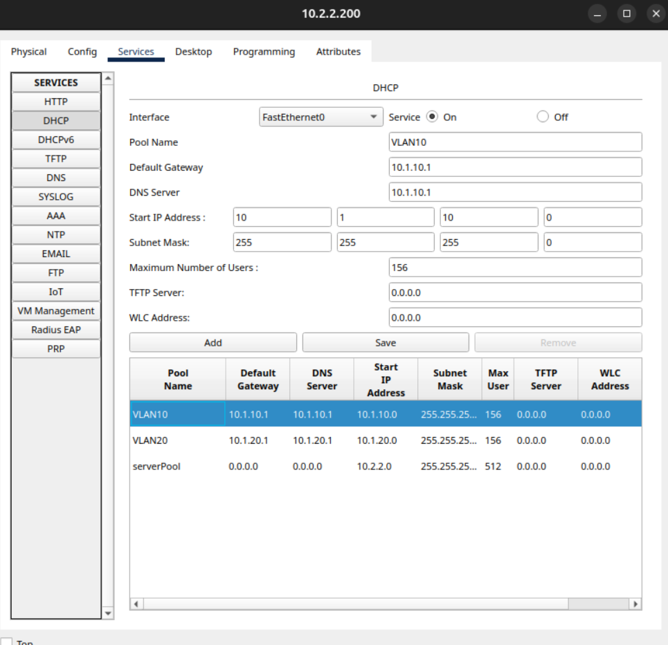

# Lab 08: Inter-VLAN Routing (RoaS) with Centralized DHCP Relay

## 📌 Project Overview
This project demonstrates the implementation of a scalable corporate network architecture combining **Inter-VLAN Routing (Router-on-a-Stick)** and a **Centralized DHCP Relay** design. 

Instead of configuring individual routers at every branch to handle local IP addressing, this architecture utilizes a central DHCP server located at Headquarters (HQ) to dynamically distribute IP addresses to separated user segments across a routed WAN infrastructure.

## 🗺️ Network Topology
The network is split into two primary routing domains connected via a point-to-point serial link:
* **Branch Office:** Users are separated into Layer 2 security zones (VLAN 10 for PC1 and VLAN 20 for PC2). A trunk link aggregates this traffic up to the Branch Router.
* **Headquarters (HQ):** Houses the main production Server Zone, including the centralized DHCP Server (`10.2.2.200`).



---

## ⚙️ How the Architecture Works

### 1. Router-on-a-Stick (RoaS) Inter-VLAN Routing
Standard Layer 2 switches cannot pass traffic between different VLANs. To allow communication between VLAN 10 and VLAN 20, this lab uses **Router-on-a-Stick**. 

Instead of running a separate physical cable for every single VLAN from the switch to the router, a single physical interface (`Fa0/0` on the Branch Router) is configured as an 802.1Q trunk link. This interface is divided into virtual **subinterfaces** (`f0/0.10` and `f0/0.20`), each acting as the default gateway for its respective VLAN. When a device wants to talk to a different subnet, its traffic travels up the trunk "stick" to the router, gets routed at Layer 3, and passes back down.

### 2. Centralized DHCP Relay (`ip helper-address`)
By default, when a computer boots up, it broadcasts a DHCP request to find an IP address. Because routers block broadcasts, these requests cannot cross the WAN to reach a central server.

To solve this, the Branch Router subinterfaces are configured with the `ip helper-address 10.2.2.200` command. When the router catches a local DHCP broadcast, it converts that broadcast into a **unicast packet** and routes it directly across the WAN to the HQ DHCP Server. 

### 3. Smart Scope Selection (`giaddr`)
When the router forwards the DHCP request, it injects its own subinterface IP address into the packet header (known as the Gateway IP Address, or `giaddr`). 

When the central DHCP server receives the packet, it reads this `giaddr` field. If the field says `10.1.10.1`, the server automatically knows to hand out an available IP address from the **VLAN10 pool**. If it says `10.1.20.1`, it hands out an IP from the **VLAN20 pool**.

---

## 💻 Device Configurations

### Layer 2 Switching Infrastructure

#### SW1 (Core/Distribution Switch)
```controlconfig
SW1(config)# vlan 10
SW1(config-vlan)# name PC1
SW1(config-vlan)# exit

SW1(config)# vlan 20
SW1(config-vlan)# name PC2
SW1(config-vlan)# exit

SW1(config)# interface G0/1
SW1(config-if)# switchport mode trunk 
SW1(config-if)# switchport trunk allowed vlan 1,10,20
```
#### SW2 (Access Switch)
```SW2(config)# vlan 10
SW2(config-vlan)# name PC1
SW2(config-vlan)# exit

SW2(config)# vlan 20
SW2(config-vlan)# name PC2
SW2(config-vlan)# exit

SW2(config)# interface f0/1
SW2(config-if)# switchport mode access
SW2(config-if)# switchport access vlan 20

SW2(config)# interface f0/2
SW2(config-if)# switchport mode trunk
```
#### Branch Router
```! Prepare physical interface
interface f0/0
 no ip address
 no shutdown
exit

! Configure Subinterfaces for Inter-VLAN Routing (RoaS)
interface f0/0.1
 encapsulation dot1q 1
 ip address 10.1.1.1 255.255.255.0
exit

interface f0/0.10
 encapsulation dot1q 10
 ip address 10.1.10.1 255.255.255.0
 ip helper-address 10.2.2.200
exit

interface f0/0.20
 encapsulation dot1q 20
 ip address 10.1.20.1 255.255.255.0
 ip helper-address 10.2.2.200
exit

! Default Static Route to HQ
ip route 0.0.0.0 0.0.0.0 209.165.201.2
```
#### HQ Router
```! Static Routes back to Branch Subnets
ip route 10.1.10.0 255.255.255.0 209.165.201.1
ip route 10.1.20.0 255.255.255.0 209.165.201.1
```
---
## 🖥️ Centralized DHCP Server Scopes
The central server (10.2.2.200) hosts the dedicated IP pools below, mapping out the precise network boundaries matching our remote branch subnets:

