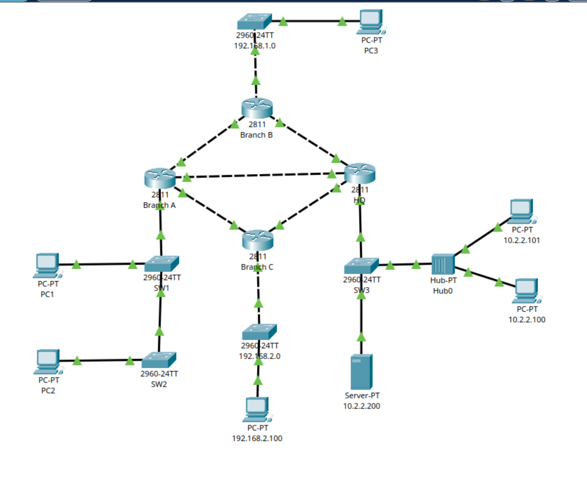

# Project 09: OSPF Multi-Branch Enterprise Network Configuration

A comprehensive Cisco Packet Tracer project implementing an enterprise multi-branch network topology. This project focuses on deploying dynamic routing via Single-Area OSPF (Area 0) to ensure full network reachability, high availability, and efficient path selection across multiple geographical sites.

## 📍 Network Topology

The infrastructure is designed with a redundant diamond-core mesh topology connecting three distinct branch offices back to the Corporate Headquarters (HQ).



---

## 🛠️ Key Network Features & Technologies

* **Dynamic Routing:** Single-Area OSPF (Area 0) configured across all layer-3 boundaries for automated route discovery and convergence.
* **Inter-VLAN Routing (Router-on-a-Stick):** Implemented on `Branch-A` using 802.1Q encapsulation (`dot1Q`) to segment local departments while allowing inter-departmental traffic.
* **Centralized DHCP Relay:** Configured `ip helper-address` on branch subinterfaces to forward local client DHCP requests across the routed core to a centralized server (`10.2.2.200`).
* **Infrastructure Hardening:**
    * Secured VTY lines with SSHv2 enforcement (`transport input ssh`).
    * Encrypted local credential stores using `service password-encryption`.
    * Customized executive login banners to enforce access policies.
* **Network Synchronization:** Network Time Protocol (NTP) synchronized across nodes to a central authority server.

---

## 🗺️ IP Addressing & Device Scheme

| Device | Interface | IP Address / Subnet | Purpose / Connection |
| :--- | :--- | :--- | :--- |
| **Branch-A** | Sub-int Fa0/0.1 <br> Sub-int Fa0/0.10 <br> Sub-int Fa0/0.20 <br> Fa0/1 <br> Et1/0 <br> Et1/1 | 10.1.1.1 /24 <br> 10.1.10.1 /24 <br> 10.1.20.1 /24 <br> 209.165.201.1 /27 <br> 172.16.1.1 /30 <br> 172.16.1.14 /30 | Native VLAN <br> User LAN 10 (DHCP Relay) <br> User LAN 20 (DHCP Relay) <br> Link to HQ <br> Link to Branch-B <br> Link to Branch-C |
| **Branch-B** | Fa0/0 <br> Fa0/1 <br> Et1/0 | 192.168.1.1 /24 <br> 172.16.1.2 /30 <br> 172.16.1.5 /30 | Local LAN Gateway <br> Link to Branch-A <br> Link to HQ |
| **Branch-C** | Et1/0 <br> Fa0/0 <br> Fa0/1 | 192.168.2.1 /24 <br> 172.16.1.10 /30 <br> 172.16.1.13 /30 | Local LAN Gateway <br> Link to HQ <br> Link to Branch-A |
| **HQ** | Fa0/1 <br> Fa0/0 <br> Et1/0 <br> Et1/1 | 10.2.2.1 /24 <br> 209.165.201.2 /27 <br> 172.16.1.6 /30 <br> 172.16.1.9 /30 | Server/HQ Local LAN Gateway <br> Link to Branch-A <br> Link to Branch-B <br> Link to Branch-C |

---

## ⚙️ Routing Configuration Breakdown

### OSPF Routing Core
The network utilizes **OSPF Process 50** on the branches and **OSPF Process 1** at HQ (demonstrating local significance of process IDs). All internal subnets, local LANs, and point-to-point transit networks are advertised entirely within **Area 0**.

Example implementation blueprint (from `Branch-A`):
```text
router ospf 50
 router-id 0.0.0.1
 network 10.1.0.0 0.0.255.255 area 0
 network 172.16.0.0 0.0.255.255 area 0
 network 209.165.201.0 0.0.0.255 area 0
```
